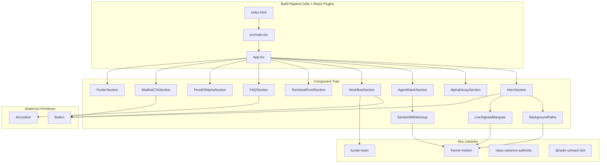
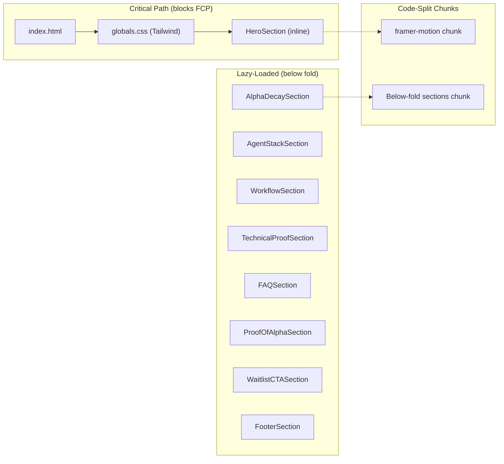

# Design Document: Landing Page V2

## Overview

Landing Page V2 migrates the Macro-Chain marketing site from vanilla HTML/CSS/JS to a React + TypeScript + Tailwind CSS + shadcn/ui architecture while preserving all existing content and the dark-mode terminal aesthetic. The migration retains Vite as the build tool (adding `@vitejs/plugin-react`) and introduces framer-motion for scroll-triggered animations, a live signals marquee, and new content sections (FAQ, Proof of Alpha, Footer, Waitlist CTA).

The page remains a single-page application with no client-side routing. All sections render within a single `<App />` component tree, lazy-loading below-fold content for performance.

**Key design decisions:**
- Keep the root `index.html` as the Vite entry point, mounting React into a `#root` div.
- Tailwind CSS replaces all V1 CSS files; design tokens move into `tailwind.config.ts` custom colours.
- shadcn/ui provides accessible primitives (Button, Accordion); framer-motion handles animation.
- The existing `/web` directory (Next.js dashboard app) is unaffected; the landing page lives at the repo root.

---

## Architecture

### System Diagram



### Data Flow

The landing page is entirely static with no server-side data fetching. All content is co-located with components as TypeScript constants. The only runtime state is:

1. **Animation state** — managed internally by framer-motion (scroll progress, animation timelines).
2. **Reduced-motion preference** — read via `useReducedMotion()` hook from framer-motion, propagated to all animated components.
3. **Marquee pause state** — local `useState` toggled on hover/focus.
4. **Waitlist interaction state** — local `useState` for button feedback.

### File Structure

```
/
├── index.html                          # Vite entry, mounts #root
├── src/
│   ├── main.tsx                        # ReactDOM.createRoot
│   ├── App.tsx                         # Section composition + lazy loading
│   ├── components/
│   │   ├── ui/                         # shadcn/ui primitives
│   │   │   ├── button.tsx
│   │   │   └── accordion.tsx
│   │   ├── background-paths.tsx        # BackgroundPaths + FloatingPaths
│   │   ├── marquee.tsx                 # Dual-row scrolling marquee
│   │   ├── section-with-mockup.tsx     # Scroll-triggered parallax layout
│   │   ├── hero-section.tsx
│   │   ├── alpha-decay-section.tsx
│   │   ├── agent-stack-section.tsx
│   │   ├── workflow-section.tsx
│   │   ├── technical-proof-section.tsx
│   │   ├── faq-section.tsx
│   │   ├── proof-of-alpha-section.tsx
│   │   ├── waitlist-cta-section.tsx
│   │   └── footer-section.tsx
│   ├── lib/
│   │   ├── cn.ts                       # clsx + twMerge utility
│   │   └── constants.ts               # Static content strings
│   ├── hooks/
│   │   └── use-reduced-motion.ts       # Wraps framer-motion hook
│   ├── fonts/
│   │   └── inter-var.woff2            # Self-hosted Inter variable font
│   └── styles/
│       └── globals.css                 # @tailwind directives + @font-face
├── tailwind.config.ts
├── tsconfig.json
├── vite.config.ts                      # Updated with @vitejs/plugin-react
├── postcss.config.js                   # tailwindcss + autoprefixer
└── components.json                     # shadcn/ui config
```

---

## Components and Interfaces

### 1. BackgroundPaths (Requirement 2)

```typescript
interface BackgroundPathsProps {
  className?: string;
}

interface FloatingPathsProps {
  position: number; // 1 or -1, determines left/right origin
}
```

- Renders a full-viewport `<div>` with `pointer-events-none` and `aria-hidden="true"`.
- `FloatingPaths` generates 36 SVG `<path>` elements with staggered framer-motion animations.
- Each path has independent `d`, `opacity`, `rotate`, and `pathLength` animation keyframes.
- Respects `prefers-reduced-motion` by setting `animate` to static values when reduced motion is active.

### 2. LiveSignalsMarquee (Requirement 3)

```typescript
interface MarqueeProps {
  items: string[];
  direction?: "left" | "right";
  speed?: number; // pixels per second
  pauseOnHover?: boolean;
  className?: string;
}

interface LiveSignalsMarqueeProps {
  className?: string;
}
```

- `LiveSignalsMarquee` composes two `<Marquee>` instances with opposite directions.
- Items are duplicated 3× to ensure seamless looping without visible gaps.
- Uses CSS `animation` with `translateX` for smooth 60fps scrolling; pauses via `animation-play-state: paused` on hover/focus.
- Marked with `aria-live="off"` and `role="marquee"` for accessibility (Requirement 13.4).

### 3. SectionWithMockup (Requirement 4)

```typescript
interface SectionWithMockupProps {
  title: string;
  description: string;
  children: React.ReactNode;
  mockupSrc?: string;
  mockupAlt?: string;
  reverse?: boolean; // flip text/image sides
  className?: string;
}
```

- Uses `useScroll` + `useTransform` from framer-motion for parallax on the mockup image.
- Entry animation triggered by `useInView` with `once: true`.
- Parallax rate: primary element at 1× scroll, secondary at 0.6× scroll.
- Disables all motion when `prefers-reduced-motion: reduce` is active (Requirement 4.6).

### 4. Button (shadcn/ui — Requirements 5, 9)

```typescript
interface ButtonProps extends React.ButtonHTMLAttributes<HTMLButtonElement> {
  variant?: "default" | "secondary" | "outline" | "ghost";
  size?: "default" | "sm" | "lg" | "icon";
  asChild?: boolean;
}
```

- Uses `class-variance-authority` for variant styling.
- `asChild` prop delegates rendering to child via `@radix-ui/react-slot`.
- Default variant uses Signal Green background; secondary uses surface colour with green border.
- Minimum touch target: 44×44px (Requirement 9.4, 13.6).

### 5. Section Components

Each section is a self-contained component receiving no props (content is internal constants):

| Component | Key Elements | Requirements |
|-----------|-------------|--------------|
| `HeroSection` | BackgroundPaths, h1, sub-headline, 2× CTA buttons, LiveSignalsMarquee | 2, 3, 12.5 |
| `AlphaDecaySection` | 3-column card grid (1st/2nd/3rd Order) | 1.5 |
| `AgentStackSection` | Bento grid (4 cards), SectionWithMockup wrappers | 4 |
| `WorkflowSection` | Copy paragraph, 2× buttons with Lucide icons | 5 |
| `TechnicalProofSection` | SVG Bayesian network diagram, Shannon Entropy text | 6 |
| `FAQSection` | 3+ Q&A pairs, stacked layout with visual differentiation | 7 |
| `ProofOfAlphaSection` | Timeline panel + Chart panel (SVG), responsive stacking | 8 |
| `WaitlistCTASection` | Headline + Button with interaction feedback | 9 |
| `FooterSection` | 3-column layout, logo, nav groups, social links, legal bar | 10 |

### 6. Accordion (FAQ — Requirement 7)

```typescript
// Uses shadcn/ui Accordion built on @radix-ui/react-accordion
// or a simple stacked layout with visual differentiation
interface FAQItem {
  question: string;
  answer: string;
}
```

- Questions rendered in `font-semibold text-text-primary`.
- Answers rendered in `font-normal text-text-secondary` with left padding for indentation.
- All text in UK English (Requirement 7.6, 15).

### Performance Strategy (Requirement 12)



- **Hero renders synchronously** — no dynamic imports for above-fold content.
- **Below-fold sections** use `React.lazy()` + `<Suspense>` with intersection observer triggers.
- **framer-motion** is code-split into its own chunk via Rollup `manualChunks`.
- **Font loading** — Inter woff2 is preloaded in `<head>` with `font-display: swap`.
- **Critical CSS** — Tailwind's purge ensures only used utilities ship; hero styles are inlined.

---

## Data Models

### Static Content Types

```typescript
// Signal items for the marquee
interface SignalItem {
  id: string;
  text: string;
}

// Agent card data
interface AgentCard {
  title: string;
  description: string;
  emphasis: "standard" | "highlighted"; // determines grid span in bento layout
}

// Alpha Decay card
interface AlphaDecayCard {
  order: "1st" | "2nd" | "3rd";
  descriptor: string;
  subDescriptor?: string;
  explanation: string;
  indicator?: string;
  highlighted: boolean;
}

// FAQ item
interface FAQItem {
  question: string;
  answer: string;
}

// Footer link group
interface FooterLinkGroup {
  heading: string;
  links: { label: string; href: string }[];
}

// Social link
interface SocialLink {
  platform: "twitter" | "linkedin" | "github";
  href: string;
  ariaLabel: string;
}
```

### Tailwind Configuration (Design System — Requirement 11)

```typescript
// tailwind.config.ts custom theme
const theme = {
  extend: {
    colors: {
      "bg-primary": "#050505",
      surface: "#1A1A1A",
      border: "rgba(42, 42, 42, 0.2)",
      "text-primary": "#EAEAEA",
      "text-secondary": "#BDBDBD",
      "signal-green": "#00E676",
    },
    fontFamily: {
      sans: ["Inter", "system-ui", "sans-serif"],
    },
    borderRadius: {
      DEFAULT: "2px",
      sm: "2px",
      md: "2px",
      lg: "2px",
    },
  },
};
```

### Vite Configuration Update

```typescript
// vite.config.ts
import { defineConfig } from "vite";
import react from "@vitejs/plugin-react";
import { resolve } from "path";

export default defineConfig({
  plugins: [react()],
  resolve: {
    alias: {
      "@": resolve(__dirname, "src"),
    },
  },
  build: {
    outDir: "dist",
    rollupOptions: {
      output: {
        manualChunks: {
          "framer-motion": ["framer-motion"],
        },
      },
    },
  },
});
```

---


## Correctness Properties

*A property is a characteristic or behavior that should hold true across all valid executions of a system — essentially, a formal statement about what the system should do. Properties serve as the bridge between human-readable specifications and machine-verifiable correctness guarantees.*

This feature is primarily a UI component migration with static content. Most acceptance criteria are best validated through example-based unit tests (verifying specific rendered output) and integration tests (E2E with Playwright for responsive layout, accessibility, and performance). However, the typography and language standards (Requirement 15) define universal constraints on all text content that are well-suited to property-based testing.

### Property 1: Text content contains no banned punctuation

*For any* text constant defined in the application's content module (`constants.ts`), the string SHALL NOT contain em dash (—), en dash (–), or exclamation mark (!) characters.

**Validates: Requirements 15.2, 15.3**

### Property 2: Text content contains no subjective superlatives

*For any* text constant defined in the application's content module (`constants.ts`), the string SHALL NOT contain any word from the banned superlatives list (including but not limited to: "revolutionary", "unmatched", "best-in-class", "game-changing", "unbelievable", "groundbreaking", "world-class").

**Validates: Requirements 15.4**

---

## Error Handling

Since the landing page is a static marketing site with no server-side data fetching or user input processing, error handling is minimal:

| Scenario | Handling Strategy | Requirement |
|----------|------------------|-------------|
| Font fails to load | `font-display: swap` ensures text renders with system font fallback | 11.3 |
| framer-motion chunk fails to load | `<Suspense fallback>` renders static content without animation | 12.4 |
| Below-fold lazy chunk fails | `<ErrorBoundary>` renders the section content statically (no animation) | 12.4 |
| SVG diagram fails to render | Accessible text alternative (`aria-label`) provides content to all users | 6.4, 8.5 |
| JavaScript disabled | Hero headline, CTA, and all text content are server-rendered in the HTML; animations degrade gracefully | 12.5 |
| Reduced motion preference | All framer-motion components check `useReducedMotion()` and render without animation | 4.6, 13.5 |

### Error Boundary Strategy

```typescript
interface ErrorBoundaryProps {
  fallback: React.ReactNode;
  children: React.ReactNode;
}
```

- A single `<SectionErrorBoundary>` wraps each lazy-loaded section.
- On error, it renders the section's static HTML content without animations.
- Errors are logged to `console.error` (no external error reporting for a marketing page).

---

## Testing Strategy

### Overview

The testing approach uses a layered strategy appropriate for a static marketing page with animations:

1. **Unit tests (Vitest + React Testing Library)** — Component rendering, content verification, accessibility attributes
2. **Property-based tests (Vitest + fast-check)** — Text content constraints (Requirements 15.2–15.4)
3. **E2E tests (Playwright)** — Responsive layout, accessibility audits, performance metrics, animation behaviour
4. **Smoke tests** — Project structure, dependency verification, build success

### Unit Tests (Vitest + @testing-library/react)

Focus areas:
- Each section component renders correct content (V1 text preservation — Req 1.5, 4.5, 5.3)
- BackgroundPaths generates exactly 36 SVG paths (Req 2.2)
- BackgroundPaths has `pointer-events-none` and `aria-hidden="true"` (Req 2.5)
- Marquee has `aria-live="off"` (Req 13.4)
- Marquee renders two rows with opposite directions (Req 3.3)
- FAQ renders ≥3 Q&A pairs with correct content (Req 7.1–7.4)
- Heading hierarchy: single h1, sequential levels (Req 13.2)
- Waitlist CTA button meets 44×44px minimum (Req 9.4)
- Footer contains all required link groups and legal text (Req 10.1–10.4)
- Icons render at 16–24px (Req 5.5)

### Property-Based Tests (Vitest + fast-check)

Configuration:
- Library: `fast-check` (standard PBT library for TypeScript)
- Minimum iterations: 100 per property
- Tag format: `Feature: landing-page-v2, Property {N}: {description}`

Tests:
- **Property 1**: Generate arbitrary strings from the constants module, assert no banned punctuation (—, –, !)
- **Property 2**: Generate arbitrary strings from the constants module, assert no banned superlatives

These tests import all exported text constants and verify the constraints hold universally.

### E2E Tests (Playwright)

Focus areas:
- Responsive layout at 375px, 768px, 1024px, 1440px, 2560px (Req 14)
- No horizontal overflow at any tested viewport (Req 14.5)
- Accessibility audit via `@axe-core/playwright` (Req 13.1)
- Keyboard navigation order matches visual order (Req 13.7)
- Focus indicators visible on all interactive elements (Req 13.3)
- Marquee pauses on hover (Req 3.4)
- Reduced motion: animations disabled when preference set (Req 4.6, 13.5)
- Performance: LCP ≤ 2.5s, CLS ≤ 0.1 (Req 12.1, 12.2) via Lighthouse CI
- Hero visible without scroll at 1024×768 (Req 12.5)
- Touch targets ≥ 44×44px for all interactive elements (Req 13.6)
- Body text font-size ≥ 16px (Req 14.4)
- Colour contrast ≥ 4.5:1 for body text (Req 11.6)
- Border-radius ≤ 2px on interactive elements (Req 11.4)

### Smoke Tests

- All component files are `.tsx` or `.ts` (Req 1.1)
- No CSS files in `src/components/` (Req 1.2)
- `src/components/ui/` directory exists with button.tsx (Req 1.3)
- `package.json` contains required dependencies (Req 1.4)
- `vite build` completes without errors
- `inter-var.woff2` exists at expected path (Req 11.3)

### Test Dependencies

```json
{
  "devDependencies": {
    "@testing-library/react": "^16.x",
    "@testing-library/jest-dom": "^6.x",
    "fast-check": "^3.x",
    "vitest": "^4.x",
    "@playwright/test": "^1.x",
    "@axe-core/playwright": "^4.x",
    "jsdom": "^29.x"
  }
}
```
