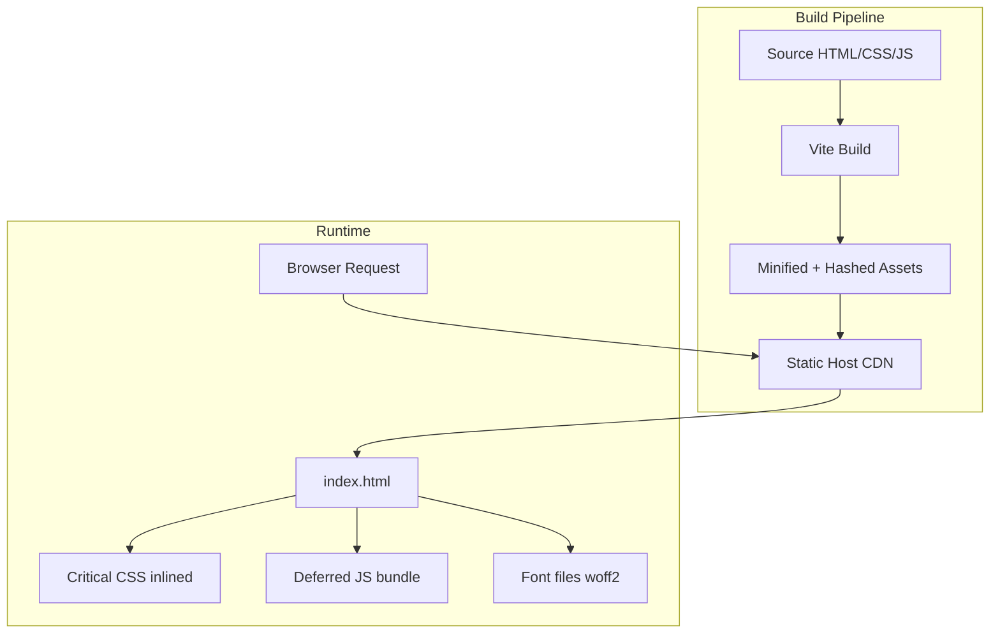
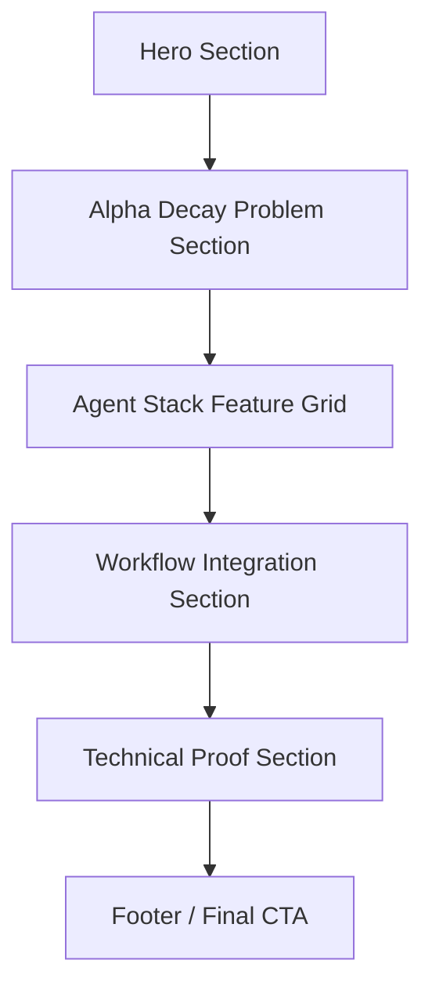

# Design Document: Macro-Chain Landing Page

## Overview

This document describes the technical design for the Macro-Chain landing page: a single-page, static, dark-mode marketing site targeting institutional fund managers. The page communicates Macro-Chain's value proposition (identifying third-order equity impacts) through a structured narrative flow from hero to conversion.

The page is purely client-side with no backend dependencies. It will be built as a static HTML/CSS/JS site optimised for performance (LCP ≤ 2.5s, CLS ≤ 0.1, INP ≤ 200ms) and accessibility (WCAG 2.1 AA).

### Key Design Decisions

| Decision | Choice | Rationale |
|----------|--------|-----------|
| Framework | Vanilla HTML + CSS + minimal JS | Static marketing page; no state management needed. Eliminates framework overhead for best LCP. |
| Build tool | Vite (static mode) | Fast dev server, asset hashing, CSS/JS minification, tree-shaking for production. |
| CSS approach | CSS custom properties + utility classes | Design system tokens as variables; no runtime CSS-in-JS cost. |
| Typography | Self-hosted Inter (woff2 subset) | Eliminates Google Fonts render-blocking request; SF Pro used as fallback on Apple devices. |
| Responsive strategy | CSS Grid + Container Queries | Native responsive without JS; breakpoints at 768px and 1024px. |
| Deployment target | Static hosting (Vercel/Netlify/S3+CloudFront) | No server required; edge-cached globally. |

## Architecture

The landing page follows a simple static-site architecture with no server-side rendering or API calls.



### Page Section Flow



Each section is a self-contained `<section>` element with semantic landmarks, enabling independent styling and testing.

## Components and Interfaces

### 1. Page Shell (`index.html`)

The root document providing semantic structure, meta tags, and critical resource hints.

```html
<!DOCTYPE html>
<html lang="en-GB">
<head>
  <meta charset="UTF-8">
  <meta name="viewport" content="width=device-width, initial-scale=1.0">
  <title>Macro-Chain | Causal Intelligence Terminal</title>
  <link rel="preload" href="/fonts/inter-var.woff2" as="font" type="font/woff2" crossorigin>
  <style>/* Critical CSS inlined at build time */</style>
  <link rel="stylesheet" href="/styles/main.css" media="print" onload="this.media='all'">
</head>
<body>
  <main>
    <section id="hero" aria-labelledby="hero-heading">...</section>
    <section id="alpha-decay" aria-labelledby="alpha-decay-heading">...</section>
    <section id="agent-stack" aria-labelledby="agent-stack-heading">...</section>
    <section id="workflow" aria-labelledby="workflow-heading">...</section>
    <section id="technical-proof" aria-labelledby="technical-proof-heading">...</section>
  </main>
</body>
</html>
```

### 2. Hero Section Component

**Responsibilities:** Display headline, sub-headline, and two CTA buttons above the fold.

| Element | HTML | Styling Notes |
|---------|------|---------------|
| Headline | `<h1 id="hero-heading">` | Largest font on page (clamp 2.5rem - 4rem), #EAEAEA |
| Sub-headline | `<p class="hero-sub">` | Secondary text colour #BDBDBD, max-width 680px |
| Primary CTA | `<a class="btn btn-primary" href="/terminal">` | Signal Green background, #050505 text, 2px radius |
| Secondary CTA | `<a class="btn btn-secondary" href="/alphas">` | Transparent background, 1px Signal Green border, Signal Green text |

### 3. Alpha Decay Section Component

**Responsibilities:** Three-column layout showing order progression with responsive stacking.

```
┌─────────────────────────────────────────────────────┐
│  Section Heading: "The Alpha Decay Problem"         │
├───────────────┬───────────────┬─────────────────────┤
│  1st Order    │  2nd Order    │  3rd Order          │
│  High Entropy │  Mkt Reaction │  The Fuse           │
│  Alpha: 0     │  Alpha: Marg. │  Signal Green border│
└───────────────┴───────────────┴─────────────────────┘
```

- CSS Grid: `grid-template-columns: repeat(3, 1fr)` above 768px
- Below 768px: `grid-template-columns: 1fr` (vertical stack)
- Third column distinguished by `border-left: 2px solid #00E676`

### 4. Agent Stack Section Component

**Responsibilities:** 2x2 feature grid with responsive single-column fallback.

| Card | Title | Description |
|------|-------|-------------|
| 1 | The Scraper | Real-time monitoring of Polymarket, Kalshi, and industrial news APIs |
| 2 | The Auditor | Autonomous parsing of 10-K filings and global shipping manifests to find hidden dependencies |
| 3 | The Entropy Model | Mathematical modelling of 'Information Decay' to determine if a link is already priced in |
| 4 | The Reporter | Institutional-grade briefs delivered instantly to your existing workflow |

- CSS Grid: `grid-template-columns: repeat(2, 1fr)` at ≥1024px
- Below 1024px: `grid-template-columns: 1fr`
- Card styling: surface colour #1A1A1A, 1px border at 20% opacity, 2px radius

### 5. Workflow Integration Section Component

**Responsibilities:** Display mock-up with non-functional integration buttons.

- Two buttons: "Send to Notion", "Alert Slack"
- Buttons have hover/active states but `event.preventDefault()` on click
- No external API calls triggered
- Section heading: "Integrations" or "Workflow"

### 6. Technical Proof Section Component

**Responsibilities:** Display concise explanations of Shannon Entropy and Bayesian Causal Networks.

- Each concept: named heading + plain-language description (≤50 words)
- No superlatives, no exclamation marks
- Factual, falsifiable statements only

### 7. Design System (CSS Custom Properties)

```css
:root {
  /* Palette */
  --color-bg-primary: #050505;
  --color-surface: #1A1A1A;
  --color-border: rgba(42, 42, 42, 0.2);
  --color-text-primary: #EAEAEA;
  --color-text-secondary: #BDBDBD;
  --color-accent: #00E676;

  /* Typography */
  --font-family: 'Inter', -apple-system, 'SF Pro Display', sans-serif;
  --font-size-body: clamp(1rem, 1vw + 0.875rem, 1.125rem);
  --font-size-h1: clamp(2.5rem, 4vw + 1rem, 4rem);
  --font-size-h2: clamp(1.75rem, 2vw + 1rem, 2.5rem);
  --font-size-h3: clamp(1.25rem, 1.5vw + 0.75rem, 1.5rem);

  /* Spacing */
  --space-xs: 0.5rem;
  --space-sm: 1rem;
  --space-md: 2rem;
  --space-lg: 4rem;
  --space-xl: 6rem;

  /* Borders */
  --radius: 2px;
  --border-width: 1px;

  /* Layout */
  --max-width: 1200px;
  --breakpoint-tablet: 768px;
  --breakpoint-desktop: 1024px;
}
```

## Data Models

This is a static page with no dynamic data. All content is hardcoded in HTML. No data fetching, state management, or data persistence is required.

### Content Model (Conceptual)

The following represents the logical structure of page content, useful for testing and content validation:

```typescript
interface HeroContent {
  headline: string;           // "Stop Trading the News. Trade the Ripple."
  subHeadline: string;        // "Identify third-order equity impacts..."
  primaryCta: { label: string; href: string };   // "Launch Terminal" -> /terminal
  secondaryCta: { label: string; href: string }; // "View Backtested Alphas" -> /alphas
}

interface AlphaDecayColumn {
  order: '1st' | '2nd' | '3rd';
  label: string;
  descriptor: string;
  subDescriptor?: string;     // Only 3rd Order has this
  explanation: string;
  indicator: string;
  highlighted: boolean;       // true for 3rd Order (Signal Green border)
}

interface AgentCard {
  title: string;
  description: string;
}

interface WorkflowSection {
  heading: string;
  copy: string;
  buttons: { label: string; functional: false }[];
}

interface TechnicalConcept {
  name: string;               // "Shannon Entropy" | "Bayesian Causal Networks"
  description: string;        // ≤50 words, plain language
}
```

## Error Handling

As a static page with no API calls or dynamic data, error handling is minimal:

| Scenario | Handling |
|----------|----------|
| Font loading failure | CSS fallback stack: `-apple-system, 'SF Pro Display', sans-serif` ensures text remains visible (FOUT over FOIT) via `font-display: swap` |
| CSS fails to load | Critical CSS inlined in `<head>` ensures above-the-fold content is styled; non-critical CSS loaded asynchronously |
| JS fails to load | Page is fully functional without JS; button hover states degrade gracefully to CSS-only `:hover`/`:active` pseudo-classes |
| Image/asset 404 | All images use meaningful `alt` text; broken image indicators are acceptable as page content is primarily text |
| Viewport edge cases | `min-width: 320px` supported; content uses `clamp()` and relative units to prevent overflow at any width up to 2560px |
| Mock buttons clicked | `event.preventDefault()` prevents navigation; no error state needed as buttons are intentionally non-functional |

## Testing Strategy

### Why Property-Based Testing Does Not Apply

This feature is a static marketing landing page. All acceptance criteria relate to:
- Visual presentation and layout (UI rendering)
- Colour values and design tokens (configuration)
- Content correctness (static text)
- Responsive breakpoint behaviour (CSS layout)
- Performance metrics (runtime measurement)
- Accessibility compliance (semantic structure)

None of these involve pure functions with meaningful input variation suitable for property-based testing. The appropriate testing approach is example-based tests, visual regression, and E2E validation.

### Test Approach

#### 1. Unit Tests (Vitest + jsdom)

Focus on content correctness and DOM structure validation:

- **Content tests**: Verify exact headline text, sub-headline text, CTA labels, card content matches requirements
- **Structure tests**: Verify semantic HTML (single h1, sequential heading levels, landmark regions)
- **Design token tests**: Verify CSS custom property values match the design system specification
- **Accessibility attribute tests**: Verify aria-labelledby references, alt text presence, role attributes

#### 2. Visual Regression Tests (Playwright)

Capture and compare screenshots at key breakpoints:

- Desktop (1440px): Full multi-column layouts
- Tablet (768px): Intermediate responsive state
- Mobile (375px): Single-column stacked layout
- Verify no horizontal overflow at 320px and 2560px extremes

#### 3. E2E / Integration Tests (Playwright)

- **Responsive layout**: Assert grid column counts at each breakpoint
- **CTA navigation**: Verify primary CTA navigates to `/terminal`, secondary to `/alphas`
- **Mock buttons**: Verify "Send to Notion" and "Alert Slack" do not trigger navigation
- **Keyboard navigation**: Tab through all interactive elements, verify focus order matches visual order
- **Focus indicators**: Verify visible focus ring on all interactive elements

#### 4. Performance Tests (Lighthouse CI)

- LCP ≤ 2.5s on simulated 25 Mbps / 50ms RTT
- CLS ≤ 0.1
- INP ≤ 200ms
- Run as part of CI pipeline on each deploy

#### 5. Accessibility Tests (axe-core + Playwright)

- Automated WCAG 2.1 AA audit via axe-core
- Contrast ratio validation for all text elements
- Touch target size validation (≥44x44px)
- Heading hierarchy validation

#### 6. Content Linting (Custom Script)

- UK English spell-check (hunspell with en_GB dictionary)
- Zero em/en dash characters in rendered text
- No warm-toned hues in CSS (hue 0-60 on HSL scale)
- Signal Green (#00E676) used only for specified purposes

### Test Configuration

```
Test Runner: Vitest (unit) + Playwright (E2E/visual)
Accessibility: @axe-core/playwright
Performance: Lighthouse CI
Spell Check: hunspell (en_GB)
CI: Run all on PR, performance on deploy preview
```
